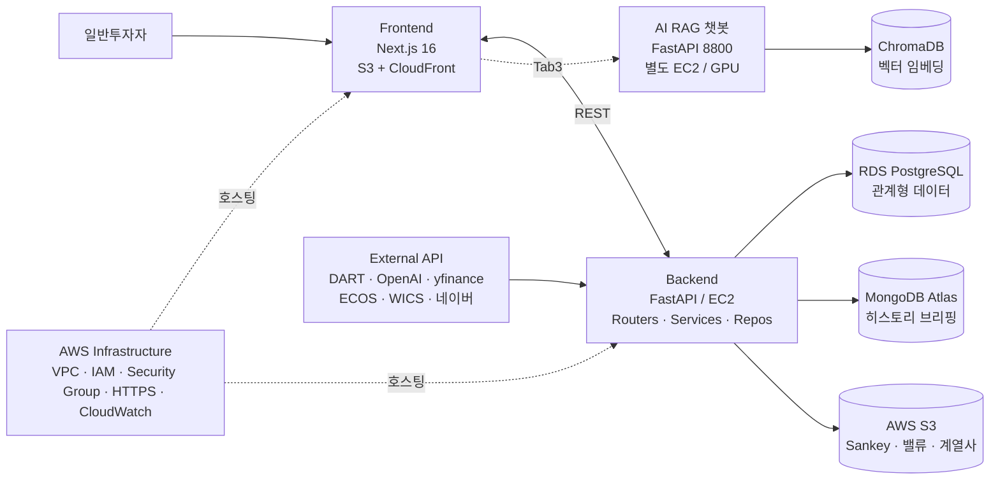
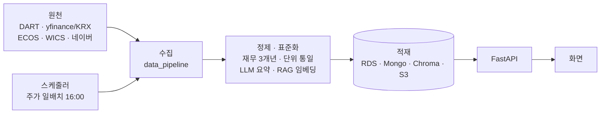

<div align="center">

# 📊 FINSIGHT

### AI 기반 기업분석 · 밸류에이션 종합 플랫폼

**"기업 분석, 이제 5분 만에"**
DART 공시 + LLM + DCF 모델링으로, 개인 투자자도 기관 수준의 분석을 한 화면에서.

🔒 **Live Demo** — https://43.203.94.124.nip.io
KPMG AI Lab 프로젝트 · 운영 FILMN9 Inc. · 분석 대상 KOSPI·KOSDAQ 약 2,600개 상장사

</div>

---

## 📌 프로젝트 기획

개인 투자자는 정보의 바다에서 길을 잃습니다. 재무제표는 DART에 있지만 전문가용이라 어렵고,
증권앱은 시세 중심이며, AI 요약은 그럴듯하지만 **출처가 불투명**해 믿기 어렵습니다.
적정주가 계산은 복잡하고요.

> **목표** — 흩어진 *재무 · 기업가치 · 뉴스 · AI 분석*을 **한 화면에서, 신뢰할 수 있게** 보여주는
> 서비스. "쉬움"과 "신뢰"를 동시에 주는, 시장의 빈틈을 채우는 플랫폼.

## 👤 페르소나

> **"스스로 공부하는 개인 투자자"**
> — 남이 찍어주는 종목이 아니라, 기업의 재무·가치·스토리를 **직접 근거를 보고** 판단하려는 사람.
> 전문 용어와 복잡한 계산 없이, 출처가 분명한 분석을 한곳에서 보길 원한다.

## 🎯 핵심 원칙 — NO-MOCK

> **"추정하지 않는다. 출처로 말한다."**

화면의 모든 수치·문장은 **DART 공시·실데이터**에 근거하며, 검증되지 않은 값은 가짜로 채우지 않고
**"데이터 없음 / 검증중"**으로 정직하게 표기합니다. 이 원칙이 FINSIGHT의 **최대 차별점**입니다.

## ✨ 주요 기능

| 영역 | 기능 |
|---|---|
| **🏠 메인** | 통합 스마트검색(기업+업종을 한 검색창에서 · "방산"→우주항공과국방) · 추천종목 캐러셀 · 업종 둘러보기 · 관심종목(★) · 글로벌 마켓 시그널(실시간 지표 신호등·종합판정) |
| **🏢 기업개요** | 재무 하이라이트(YoY) · 재무 건전성 · 손익흐름도(Sankey) · 3개년 재무제표 · **AI 히스토리 브리핑** · **계열회사 시각화(2,362종)** · 주주·경영인·공시·뉴스 |
| **💰 밸류에이션** | DCF 적정주가(Bear/Base/Bull) · WACC · 멀티플 · 민감도·토네이도 · 4-Way 내재가치 · **신뢰도 등급**(못 믿는 값은 "검증중" 정직 표기) |
| **🤖 AI 챗봇** | 사업보고서 RAG 챗봇 — 답변마다 **출처 카드·DART 링크**(환각 대신 근거) |
| **🛠 관리자** | 운영 모니터링 · 신뢰도 검증(원본 대조 오류율) · 데이터 신선도 · AWS 비용 (토큰 인증) |

## 🏗 시스템 아키텍처

좌→우 5계층(사용자 → 화면 → API → 데이터) + 외부 데이터 유입 + 인프라가 전 계층을 호스팅.
**계층 분리(3-tier)** 와 **마이크로서비스**(메인 API ↔ RAG 챗봇 분리)를 적용했습니다.



## 🔄 데이터 파이프라인

공식 원천 → 수집 → 정제·표준화·LLM 요약 → 하이브리드 DB 적재 → API → 화면.
주가는 **매 거래일 자동 동기화(16:00 스케줄러)**, 손익흐름도·밸류·계열사는 **배치 사전생성**합니다.



## 📋 요구사항 정의서

| 구분 | 항목 |
|---|---|
| **기능 요구** | 종목·산업 탐색 / 3개년 재무 조회 / DCF 밸류에이션 / AI 히스토리 브리핑 / RAG 챗봇 / 관리자 신뢰도 검증 / 관심종목 |
| **비기능 요구** | **성능**: 캐싱(모닝 위젯 15분)·사전생성으로 빠른 응답 · **보안**: `.env` 시크릿 분리(코드/Git 금지)·HTTPS·CORS·관리자 토큰 인증 · **신뢰성**: NO-MOCK 데이터 품질·면책 고지 · **데이터원**: DART 등 **공식 출처만** |

## 🧰 기술 스택

| 구분 | 기술 |
|---|---|
| Frontend | Next.js 16 · React 19 · TypeScript · Tailwind |
| Backend | FastAPI · Python 3.11 (Routers → Services → Repositories) |
| AI / RAG | OpenAI gpt-5-mini · BGE-M3 임베딩 · bge-reranker-v2-m3 · ChromaDB |
| Database | AWS RDS PostgreSQL · MongoDB Atlas · ChromaDB · AWS S3 |
| Infra / DevOps | AWS EC2·RDS·S3 · nginx(리버스 프록시) · Let's Encrypt(HTTPS) · systemd · GitHub |

## 🌐 데이터 원천

**DART OpenAPI**(재무·공시 XBRL) · **yfinance·KRX(pykrx)**(주가) · **ECOS·KOFIA**(금리) ·
**WICS(FnGuide)**(78업종 분류) · **네이버**(뉴스·환율) · **OpenAI**(RAG·요약) — 전부 공식 출처.

## 📅 프로젝트 스토리 (WBS)

> 킥오프(4/22) → 최종 발표(6/20) · **5개 스프린트** ·
> 전략: *"리스크 큰 것부터 증명하고, 정확히 만들고, 세상에 올린다."*

| 스프린트 | 기간 | 핵심 |
|---|---|---|
| 킥오프·S1 | 4/22~4/28 | 팀빌딩·프로젝트 헌장·페르소나·기획서·**요구사항 정의서** |
| **S2** | 4/29~5/9 | **가장 어려운 밸류에이션 엔진부터** — DCF 3시나리오·WACC·멀티플·피어 선정 |
| S3 | 5/12~5/22 | 기업개요·AI 히스토리 브리핑(RAG)·Next.js UI·1차 로컬 배포 |
| S4 | 5/26~6/5 | 재무 정확성(XBRL 3개년)·AI 브리핑 전수화·UI/UX 고도화·관리자 페이지 |
| **S5** | 6/8~6/19 | **DB 클라우드 이관(→AWS RDS)·계열사 전종목·메인 리디자인·AWS 배포 + HTTPS**·QA |

## 📂 디렉터리 구조

```
FINSIGHT/
├─ frontend/             # Next.js 화면 (메인·종목상세 3탭·산업탐색·관리자)
├─ backend/              # FastAPI (routers · services)
├─ chatbot/              # RAG 챗봇 마이크로서비스 (:8800)
├─ data_pipeline/        # 데이터 수집·적재 스크립트
├─ DCF_밸류에이션엔진/    # 밸류에이션 엔진 (DCF·WACC·멀티플)
├─ 기업개요_파트/         # 재무·히스토리 브리핑·계열사 모듈
├─ database/             # 스키마·적재
├─ docs/                 # PM 산출물 (기획·요구사항·WBS·아키텍처·ERD)
└─ 통합산출물/            # 발표 자료·다이어그램·검수 리포트
```

## 🚀 시작하기

```bash
# Backend (FastAPI :8090)
python -m uvicorn backend.main:app --app-dir . --port 8090

# Frontend (Next.js :3000)
cd frontend && npm install && npm run dev
#  → http://localhost:3000   (Live: https://43.203.94.124.nip.io)
```

- 의존성: `requirements.txt`(Python) · `frontend/package.json`(Node)
- 환경변수: `.env`(DART·OpenAI·MongoDB 키) — **비공개, 저장소 미포함**
- 비공개 항목(용량·보안): 실데이터 `data/`(약 40GB) · 벡터DB · `.env` — Git 제외, 별도 전달

## 👥 팀 · 역할

**기업개요·재무 파트** · **밸류에이션 파트** · **AI 챗봇 파트** · **PM/공통**
KPMG AI Lab 교육 프로젝트 (운영: FILMN9 Inc.)

---

<div align="center">
<sub><b>FINSIGHT</b> · FILMN9 Inc. · KPMG AI Lab · <b>NO-MOCK</b>: 추정하지 않는다, 출처로 말한다</sub>
</div>
