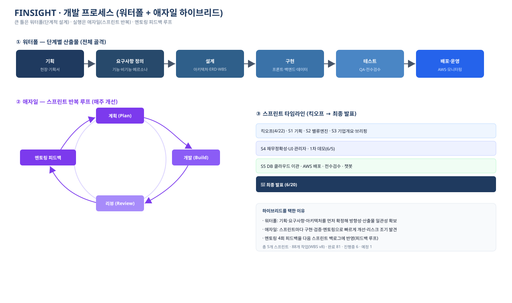
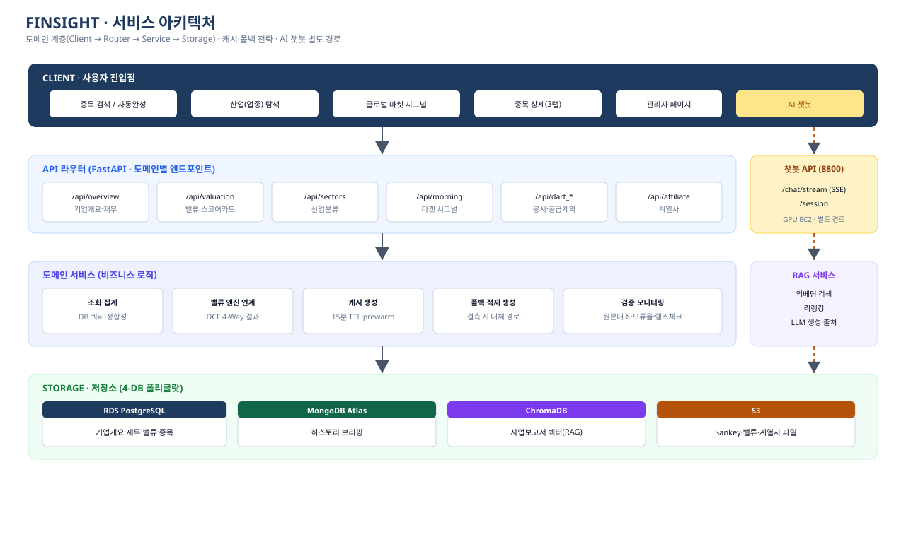
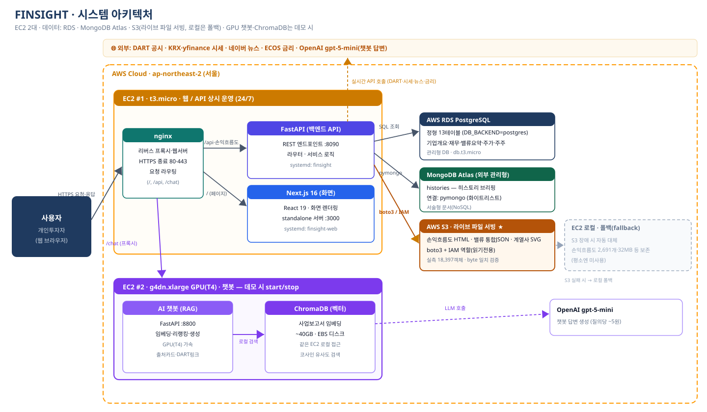
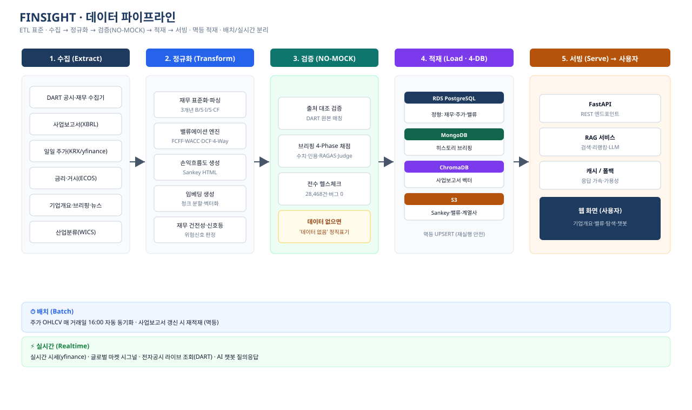
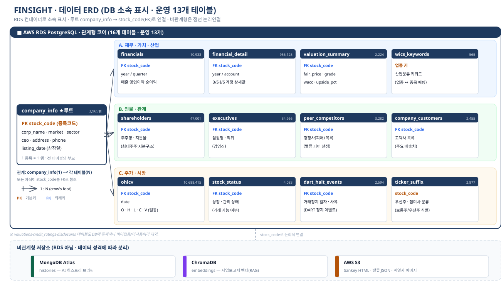

# FINSIGHT

KOSPI·KOSDAQ 상장사 약 3,000개 기업의 공시·재무·시세 데이터를 한곳에 모아, 기업분석부터 적정주가 산정과 AI 질의응답까지 한 화면에서 제공하는 기업가치 분석 서비스입니다.

- 라이브: https://43.203.94.124.nip.io/
- 저장소: https://github.com/blackhole-24/FILMN9
- 운영: FILMN9 Inc. / KPMG AI Lab · 2026

개인투자자는 공시·재무·시세·뉴스가 흩어져 있어 한 기업을 종합적으로 보기 어렵습니다. FINSIGHT는 이 데이터를 자동으로 수집·정규화·검증해 종목 하나를 여러 각도에서 한 번에 볼 수 있게 했습니다. 단, 값을 임의로 지어내지 않는다는 원칙(NO-MOCK)을 지켜, 데이터가 없으면 비워 두고 '준비중'으로 표시합니다. 이 '추정하지 않고 출처로 말한다'는 원칙 — 출처 의무, 정직한 공백, 관리자 검증, 전수 헬스체크 — 이 FINSIGHT의 가장 큰 차별점입니다.

## 목차

1. [프로젝트 계획서 (개정)](#s1)
2. [작업 분할 구조(WBS) 개정](#s2)
3. [요구사항 정의서](#s3)
4. [유스케이스 명세서](#s4)
5. [프로젝트 설계서](#s5)
6. [시스템 아키텍처](#s6)
7. [데이터 설계](#s7)
8. [기술 스택](#s8)
9. [대시보드 설계](#s9)
10. [개발 코드](#s10)
11. [발표 자료](#s11)
12. [예상 문제 및 해결 방안](#s12)
13. [사업성 (개발 원가·수익 모델)](#s13)

---

<a id="s1"></a>
## 1. 프로젝트 계획서 (개정)

| 항목 | 내용 |
|---|---|
| 프로젝트명 | FINSIGHT — KOSPI·KOSDAQ 기업 AI 가치분석 플랫폼 |
| 운영 / 소속 | FILMN9 Inc. · KPMG AI Lab |
| 기간 | 2026-04-22(킥오프) ~ 2026-06-20(최종 발표), 약 9주 |
| 방법론 | 워터폴(단계 설계)과 애자일(스프린트 반복) 혼합, 멘토링 4회 |

### 배경과 목적
주식을 막 시작한 개인투자자(주 페르소나)는 보통 네 가지 어려움을 겪습니다 — 정보가 여러 곳에 흩어져 있고, 용어가 어렵고, 출처를 믿기 어렵고, 결국 지금 주가가 적정한지 판단하기 어렵습니다. FINSIGHT는 신뢰할 수 있는 출처(DART·KRX 등)의 데이터만 모아 기업분석·적정주가·AI 챗봇을 하나의 흐름으로 묶고, 같은 화면을 초보자용과 전문가용 두 깊이로 보여줘 누구나 스스로 판단할 수 있게 하는 것을 목표로 했습니다.

### 대상 사용자
- 개별 종목을 직접 분석하려는 개인투자자 (주 사용자)
- 데이터 신선도와 정확도를 점검하는 운영 관리자

### 범위
- 포함: 상장사 약 3,000종목의 기업개요·재무·주가·주주·경영진·공시·뉴스, 전종목 자동 밸류에이션, 사업보고서 기반 RAG 챗봇, 산업(업종) 탐색, 글로벌 마켓 시그널, 관리자 페이지
- 제외: 실거래(주문) 기능과 투자 자문. 서비스는 어디까지나 참고용 정보 제공에 한정합니다.

### 일정
| 마일스톤 | 일자 | 비고 |
|---|---|---|
| 킥오프 (프로젝트 헌장) | 04/22 | 주제·페르소나·WBS 초안 |
| 1차 데모 (로컬 배포) | 06/05 | MVP 통합 |
| DB 클라우드 이관·AWS 배포 | 06/08~ | RDS·EC2·S3 |
| 최종 발표·수료 | 06/20 | 데모·발표자료 |

### 팀 구성
파트별 책임 영역으로 나눠 개발했고, 통합·배포·QA는 공통으로 진행했습니다.

| 담당 | 역할 |
|---|---|
| 이형주 | PM — 기획·요구사항·WBS·발표, 통합·배포·비기능 QA |
| 고휘주 | 기업분석 — 데이터 파이프라인·재무 정확성·UI·인프라 |
| 유태상 | 밸류에이션 엔진(DCF·WACC·4-Way)·스코어카드 UI·AI 챗봇 |
| 손소희 | 재무·밸류에이션 초기 설계 |

---

<a id="s2"></a>
## 2. 작업 분할 구조(WBS) 개정

전체 작업은 킥오프와 최종 발표를 양 끝에 두고 5개 스프린트로 진행했습니다. 큰 골격은 워터폴로 먼저 잡고, 각 스프린트 안에서는 구현·검증·멘토링을 반복하는 방식입니다.



WBS v8 기준 전체 88개 작업 중 완료 81개, 진행중 6개, 예정 1개입니다. 진행중인 항목은 MCP 서버, QA(테스트 케이스·비기능 검증), ChromaDB의 GPU 인스턴스 이전, 발표 PPT·리허설이며, 예정은 최종 발표입니다.

| 스프린트 | 기간 | 핵심 작업 |
|---|---|---|
| 킥오프 | 04/22~04/24 | 프로젝트 헌장, 페르소나, WBS 초안 |
| S1 기획 | 04/27~04/28 | 기획서, 요구사항 정의서, 협업환경(Notion·GitHub·Drive) |
| S2 밸류엔진 MVP | 04/29~05/09 | WACC·FCF·DCF(Bear/Base/Bull), 멀티플, 피어 선정 알고리즘, Figma |
| S3 기업개요·브리핑 | 05/12~05/22 | DART 수집, AI 히스토리 브리핑(RAG), Next.js 3탭, 1차 멘토링 |
| S4 정확성·UI·관리자 | 05/26~06/05 | XBRL 3개년, 4-Way 내재가치, UI 고도화, 챗봇 임베드, 관리자 페이지, 1차 데모 |
| S5 클라우드·전수검수 | 06/08~06/19 | RDS 이관(16테이블·1,175만행), 전종목 NO-MOCK 검증, 계열사 SVG(2,362종), AWS 배포 |
| 최종 발표 | 06/20 | 발표 및 수료 |

스프린트별 Task·Subtask·담당·상태는 `docs/FILMN9_WBS_v8.xlsx`(88행)에 정리돼 있습니다. 참고로 5스프린트에서 데이터베이스를 SQLite에서 AWS RDS PostgreSQL로 옮기면서 회귀 검증(행수 일치)을 거쳤습니다.

---

<a id="s3"></a>
## 3. 요구사항 정의서

### 기능 요구사항

| ID | 기능 | 설명 |
|---|---|---|
| FR-01 | 종목 검색·자동완성 | 기업명·종목코드 통합 검색, 업종 그룹 드롭다운, 관심종목 즐겨찾기 |
| FR-02 | 기업분석(개요) | 재무 하이라이트, 건전성 신호등, 손익흐름도(Sankey), 주주, 경영진, 공시, 뉴스 |
| FR-03 | 밸류에이션 | 전종목 적정주가 자동 산출. DCF와 3개 멀티플을 합친 4-Way 교차검증, 스코어카드 |
| FR-04 | AI 히스토리 브리핑 | 사업보고서 RAG 요약과 신뢰도 등급(4-Phase 채점) |
| FR-05 | AI 챗봇 | 사업보고서 근거 기반 질의응답(출처 카드·DART 링크) |
| FR-06 | 산업(업종) 탐색 | WICS 산업분류 기반 종목 탐색·대장주 |
| FR-07 | 글로벌 마켓 시그널 | 미국 3대 지수, 상해종합, 공포탐욕 지수 |
| FR-08 | 관리자 페이지 | 데이터 커버리지, 신뢰도 검증, 신선도, AWS 비용 모니터링 |

### 비기능 요구사항

| ID | 항목 | 기준 |
|---|---|---|
| NFR-01 | 신뢰성(NO-MOCK) | 임의 수치 금지, 결측 시 '준비중' 표기 |
| NFR-02 | 성능 | 응답 캐시 15분 TTL과 prewarm, 스켈레톤 로딩 |
| NFR-03 | 가용성 | 프론트·백·챗봇·DB 분리, S3 장애 시 EC2 로컬 폴백 |
| NFR-04 | 보안 | HTTPS 전구간, 보안그룹 화이트리스트, `.env` 런타임 로드, 관리자 토큰 인증 |
| NFR-05 | 정직성 | 투자 권유가 아닌 참고용 면책 문구 명시 |

---

<a id="s4"></a>
## 4. 유스케이스 명세서

주 액터는 개인투자자, 보조 액터는 관리자입니다.

| ID | 유스케이스 | 주요 흐름 |
|---|---|---|
| UC-01 | 종목 분석 조회 | 검색 → 종목 상세 → 기업분석 탭에서 재무·건전성·주주·뉴스 확인 |
| UC-02 | 적정주가 확인 | 밸류에이션 탭 → 스코어카드 → 동종비교·DCF → 전문가용 상세 |
| UC-03 | AI 질의응답 | AI 챗봇 탭 → 자연어 질문 → RAG 답변과 출처 카드 |
| UC-04 | 산업 탐색 | 업종 드롭다운·둘러보기 → 동종 종목 비교 |
| UC-05 | 운영 점검(관리자) | `/admin` 토큰 인증 → 커버리지·신뢰도·신선도·비용 모니터링 |

### UC-02 적정주가 확인 (상세)
선행조건은 평가가 완료된 종목입니다. 미평가 종목은 NO-MOCK 원칙에 따라 '준비중'으로 표시합니다.

1. 사용자가 종목 상세의 밸류에이션 탭에 들어간다.
2. 화면 맨 위 스코어카드에서 현재가, 동종업계 기준 가치, 결론(오를 여지/적정/내릴 위험), 가치 미터를 본다.
3. 아래로 스크롤하며 동종업계 비교(멀티플), 비교 회사(피어), 회사 성격과 DCF, 다음 동선을 확인한다.
4. 필요하면 '전문가용 자세히'를 펼쳐 필요성장률, ROIC vs WACC, 자본구조, 데이터 출처까지 본다.

동종 기준 가치가 현재가와 5배 이상 벌어지면 '신뢰도 낮음' 경고가 자동으로 표시됩니다.

---

<a id="s5"></a>
## 5. 프로젝트 설계서

### 서비스 아키텍처
클라이언트 요청은 FastAPI 라우터를 거쳐 도메인 서비스로 가고, 4종 저장소(폴리글랏)에서 데이터를 읽어옵니다. AI 챗봇만 GPU 자원을 분리하려고 별도 경로(:8800)를 씁니다.



| 라우터 | 도메인 |
|---|---|
| `/api/overview` | 기업개요·재무 |
| `/api/valuation` | 밸류·스코어카드 |
| `/api/sectors` | 산업분류 |
| `/api/morning` | 마켓 시그널 |
| `/api/dart_*` | 공시·공급계약 |
| `/api/affiliate` | 계열사 |
| `/chat/stream` (8800) | RAG 챗봇 (SSE) |

### 밸류에이션 엔진 (6대 공식)
적정주가는 아래 여섯 공식으로 계산하며, 절대가치(DCF) 한 개와 상대가치(멀티플) 세 개를 묶어 4-Way로 교차검증해 한쪽으로 치우치지 않게 했습니다.

| 공식 | 역할 |
|---|---|
| DCF (현금흐름 할인) | 미래 FCFF를 현재가치로 합산해 기업가치, 적정주가 산출 |
| FCFF (잉여현금흐름) | `EBIT(1−Tc) + D&A − CapEx − ΔNWC` |
| 터미널밸류 (고든 성장) | 예측기간 이후 영구가치. 조건 `WACC > g`, g는 1~3%로 보수적 설정 |
| WACC (가중평균자본비용) | `(E/V)Re + (D/V)Rd(1−Tc)` |
| CAPM (자기자본비용) | `Re = Rf + β(Rm−Rf)`, β는 Blume·Hamada 보정 |
| 상대가치 역산 | PER·PBR·EV/EBITDA 피어 중앙값 배수로 역산 |

공식별 변수 풀이와 계산 흐름(5단계)은 `docs/FINSIGHT_Appendix_상세.docx`의 A1 절에 있습니다.

### RAG 챗봇 파이프라인
AI 챗봇은 답하기 전에 신뢰할 수 있는 문서(사업보고서)를 먼저 검색하고, 그 근거 위에서만 답을 생성합니다(검색증강생성, 9단계). 임베딩(BGE-M3), 하이브리드 검색(BM25+벡터), 재랭킹을 거쳐 출처 카드와 함께 답하므로 환각을 줄입니다. 단계별 상세는 `docs/FINSIGHT_Appendix_상세.docx`의 A2 절에 있습니다.

---

<a id="s6"></a>
## 6. 시스템 아키텍처

EC2 두 대로 구성했습니다. 1번(t3.micro)은 nginx, FastAPI, Next.js로 웹과 API를 상시 운영하고, 2번(g4dn.xlarge, GPU T4)은 RAG 챗봇과 ChromaDB를 데모할 때만 켜고 끕니다. 데이터는 RDS, MongoDB Atlas, S3에서 가져오며 S3에 문제가 생기면 EC2 로컬이 대신합니다.



### 데이터 파이프라인
수집 → 정규화 → 검증(NO-MOCK) → 적재(4-DB) → 서빙 순으로 흐르고, 멱등 UPSERT라 다시 돌려도 안전합니다. 배치와 실시간 레인을 나눠 두었습니다.



- 배치: OHLCV는 매 거래일 16시 전후 자동 동기화, 사업보고서가 갱신되면 재적재
- 실시간: 시세(yfinance), 글로벌 시그널, DART 라이브 조회, AI 챗봇
- 운영: nginx HTTPS(Let's Encrypt), systemd 서비스, boto3와 IAM 읽기전용 권한, GPU는 EBS에 데이터를 두고 인스턴스를 정지해 미사용 시 비용이 들지 않게 함

인프라와 보안 설계는 `docs/FINSIGHT_Appendix_상세.docx`의 A5 절을 참고하세요.

---

<a id="s7"></a>
## 7. 데이터 설계

데이터 성격에 따라 4종 DB를 함께 씁니다(폴리글랏 퍼시스턴스). 관계형 코어(RDS)는 `company_info`를 루트로 두고 `stock_code`를 PK/FK로 삼아 13개 운영 테이블이 1:N으로 연결됩니다. 문서·벡터·파일 저장소는 `stock_code`로 논리적으로 연결합니다.



| DB | 유형 | 저장 데이터 |
|---|---|---|
| RDS PostgreSQL | 정형 | 기업개요·재무·밸류·주가·주주 등 13테이블 |
| MongoDB Atlas | 문서 | AI 히스토리 브리핑 |
| ChromaDB | 벡터 | 사업보고서 임베딩(RAG) |
| AWS S3 | 파일 | 손익흐름도 HTML, 밸류 JSON, 계열사 SVG |

주요 테이블과 적재 행수는 다음과 같습니다.

| 테이블 | 행수 | 테이블 | 행수 |
|---|---:|---|---:|
| company_info (루트) | 3,965 | shareholders | 47,001 |
| financials | 10,933 | executives | 34,966 |
| financial_detail | 956,125 | peer_competitors | 3,282 |
| valuation_summary | 2,224 | company_customers | 2,455 |
| wics_keywords | 565 | ohlcv (일봉) | 10,688,415 |
| stock_status | 4,083 | dart_halt_events | 2,594 |
| ticker_suffix | 2,877 | | |

ERD 설계 원칙과 4-DB 매핑은 `docs/FINSIGHT_Appendix_상세.docx`의 A4 절에 정리했습니다.

---

<a id="s8"></a>
## 8. 기술 스택

| 레이어 | 기술 |
|---|---|
| 프론트엔드 | Next.js 16, React 19, standalone 서버(:3000) |
| 백엔드 | FastAPI(:8090), Python, psycopg, systemd |
| AI / RAG | ChromaDB, 임베딩·리랭킹(로컬 GPU T4), OpenAI gpt-5-mini(답변 생성) |
| 데이터베이스 | AWS RDS PostgreSQL, MongoDB Atlas, ChromaDB(약 40GB EBS), AWS S3 |
| 인프라 | AWS EC2(t3.micro, g4dn.xlarge), nginx, Let's Encrypt, boto3/IAM |
| 데이터 원천 | DART, KRX·yfinance, 한국은행 ECOS, 네이버 뉴스, WICS |
| 협업 | GitHub, Notion, Google Drive, Figma, v0.dev |

---

<a id="s9"></a>
## 9. 대시보드 설계

### 종목 상세 (3탭)
- 기업분석: 재무 하이라이트, 건전성 신호등, 손익흐름도(Sankey), 주주, 경영진, 공시, 뉴스
- 밸류에이션: 스코어카드(결론·가치미터)에서 동종비교, 피어, DCF, 전문가용으로 이어지는 흐름
- AI 챗봇: 사업보고서 RAG 질의응답과 출처 카드

### 관리자 페이지
운영 모니터링(커버리지·검색·작동 확인), 신뢰도 검증(샘플 원본 대조·오류율), 데이터 신선도(기준일·원천), AWS 비용·리소스 탭으로 구성했고 `/admin`은 토큰 인증을 둡니다.

### 메인·스코어카드
통합 스마트검색, 추천종목 캐러셀, 업종 둘러보기를 두고, 밸류 결과는 투자자가 보기 쉬운 점수카드 형태로 정리했습니다.

---

<a id="s10"></a>
## 10. 개발 코드

저장소는 https://github.com/blackhole-24/FILMN9, 배포본은 https://43.203.94.124.nip.io/ 에서 확인할 수 있습니다.

```
FILMN9/
├── backend/         FastAPI — 라우터·서비스 로직 (:8090)
├── frontend/        Next.js 16 + React 19 (:3000)
├── chatbot/         RAG 챗봇 — 임베딩·리랭킹·LLM (:8800)
├── data_pipeline/   ETL 수집·정규화·검증·적재
├── database/        스키마·마이그레이션
├── scripts/         운영·동기화 (OHLCV 일배치 등)
└── docs/            문서·다이어그램
```

실행은 백엔드 `uvicorn backend.main:app --port 8090`, 프론트 `cd frontend && npm run dev`, 챗봇은 GPU 환경의 FastAPI(:8800)로 띄웁니다. DART·OpenAI 키와 MONGO_URI 같은 비밀값은 `.env`로 런타임에 주입하며 저장소에 커밋하지 않습니다.

---

<a id="s11"></a>
## 11. 발표 자료

| 산출물 | 설명 |
|---|---|
| [Appendix 기술 상세](docs/FINSIGHT_Appendix_상세.docx) | 밸류 6대 공식, RAG 파이프라인, 4-Phase 검증, 인프라, 전수검수, 초보자 튜토리얼(A1~A9) |
| [금융·개발 용어 백과사전](docs/FINSIGHT_용어사전.docx) | 비전공자도 볼 수 있게 정의·비유·활용 세 줄로 정리한 용어집 |
| [WBS v8 진행상태](docs/FILMN9_WBS_v8.xlsx) | 스프린트별 작업과 상태 88행 |
| [발표 본편 (PPT)](docs/FINSIGHT_발표.pptx) | 36장 — 기획배경·페르소나, 시스템·데이터 설계, 팀 역할, 밸류에이션, AWS 라이브 시연, Appendix(원가·수익·AI 매핑·전수검수), Q&A |
| 다이어그램 | `assets/` — 시스템·서비스 아키텍처, 데이터 파이프라인, ERD, 개발 프로세스(SVG) |

발표는 소개 → 기획배경 → 개발·설계 → 팀 → 밸류에이션 → AWS 라이브 시연 → 마무리(비전) 순으로 구성했고, 부록에 원가·수익모델·AI 기술 매핑·6대 공식·RAG 9단계·전수검수·용어집을 담았습니다. 이 문서는 산출물 전체의 색인 역할을 합니다.

---

<a id="s12"></a>
## 12. 예상 문제 및 해결 방안

| 예상 문제 | 해결 방안 |
|---|---|
| LLM이 근거 없는 답을 지어냄(할루시네이션) | RAG로 사업보고서를 먼저 검색해 그 근거 위에서만 답을 생성하고 출처를 함께 보여줌 |
| 데이터 결측·오류 | NO-MOCK 원칙으로 임의 수치를 만들지 않고 '준비중' 표기, 전종목 전수 검증 |
| DCF를 단일 정답처럼 오해 | 단일값 대신 범위로 제시하고, 현재가와 5배 이상 벌어지면 '신뢰도 낮음' 경고 |
| 피어 자동 선정에 엉뚱한 회사 혼입 | 10개 기준 점수로 뽑되 A~E 등급과 비교 회사 목록을 그대로 공개 |
| GPU 비용 부담 | 데이터는 EBS에 보존하고 인스턴스를 정지해 미사용 시 비용 0, 데모 때만 가동 |
| 한 부분 장애가 전체로 번짐 | 프론트·백엔드·챗봇·DB를 분리해 장애를 격리 |
| S3 파일 서빙 장애 | EC2 로컬 폴백으로 자동 대체 |
| 키 유출·무단 접근 | `.env` 런타임 로드, 보안그룹 화이트리스트, HTTPS, 관리자 토큰 인증 |
| 대용량 종목 응답 지연 | 캐시 15분 TTL과 prewarm, 인덱스 워밍업, 스켈레톤 로딩 |
| AI 요약 품질 편차 | 히스토리 브리핑을 4-Phase로 채점하고 저점수는 재생성(약 2,526종목 평균 77.1점) |

전수 검수와 NO-MOCK 검증 체계는 `docs/FINSIGHT_Appendix_상세.docx`의 A7·A8 절에 있습니다. 활성 2,588종목 × 11개 API = 28,468건을 자동 점검했고, 데모를 막는 버그는 0건, 정상률 99.97%였습니다.

---

<a id="s13"></a>
## 13. 사업성 (개발 원가·수익 모델)

발표 부록에서 다룬 사업성 검토입니다. 단가 등 추정치는 가정임을 명시했습니다(NO-MOCK 원칙은 사업성 수치에도 동일하게 적용).

### 개발 원가
인건비(맨먼스)와 직접비(실제 결제분)로 나눠 산정했고, 추정 단가가 들어간 항목은 '(가정)'으로 표기했습니다.

### 수익 모델
- 무료: 핵심 기업분석·밸류에이션·챗봇 기본 기능
- Pro 구독(가정): 월 9,900원 — 심화 분석·사용 한도 확대 등
- 손익분기(BEP, 가정): 월 수백 명 수준의 Pro 전환이면 흑자 구간이며, 대상 시장은 개인투자자 수백만 명입니다.

원가·수익 상세 표는 발표 본편 PPT(`docs/FINSIGHT_발표.pptx`)의 Appendix 슬라이드를 참고하세요.

---

FINSIGHT는 투자 참고용 정보를 제공하며 매수·매도를 권유하지 않습니다. · FILMN9 Inc. / KPMG AI Lab, 2026
