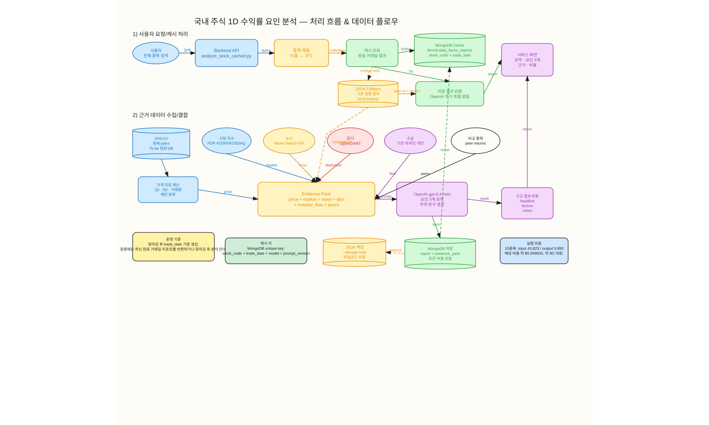

# Daily Factor Analysis

국내 주식의 1D 수익률을 계산하고, 주가에 영향을 줬을 가능성이 있는 요인을 3가지로 요약하는 요청형 AI 분석 모듈입니다.

사용자가 종목을 검색하면 MongoDB에 같은 거래일의 분석 결과가 있는지 먼저 확인하고, 없을 때만 뉴스/공시/시장/가격 데이터를 수집해 OpenAI로 요약을 생성합니다. 생성된 결과는 MongoDB에 저장되어 같은 날짜에는 재사용됩니다.

## 처리 흐름



## 구현 완료 기능

- 종목 마스터 기반 종목명 또는 종목코드 요청형 분석
- 전일 종가 대비 당일 종가 기준 1D 수익률 계산
- 최근 5거래일 수익률 및 가격 패턴 분류
- KOSPI/KOSDAQ 시장 수익률 대비 초과수익률 계산
- 네이버 뉴스 API 기반 관련 뉴스 수집
- OpenDART 기반 당일/직전일 공시 수집
- OpenAI `gpt-5.4-mini` 기반 요인 3가지 요약
- MongoDB `filmn9.daily_factor_reports` 캐시 조회/저장
- 같은 날짜 같은 종목 재요청 시 OpenAI 추가 호출 없이 저장 결과 반환
- 10종목 실험 배치 및 결과 정리 문서 제공

## 폴더 구조

```text
daily_factor_analysis/
  README.md
  data/
    ticker_universe.csv
  scripts/
    analyze_stock_cached.py
    run_daily_factor_report.py
    make_daily_factor_flow_excalidraw.py
  docs/
    diagrams/
      daily_factor_on_demand_flow.excalidraw
      daily_factor_on_demand_flow.svg
    reports/
      10종목_일일요인분석_결과정리.md
```

## 포함 파일

| 경로 | 설명 |
|---|---|
| `data/ticker_universe.csv` | 전체 종목 검색용 종목 마스터 |
| `scripts/analyze_stock_cached.py` | 메인 실행 파일. 종목 요청형 AI 요인 분석 및 MongoDB 캐시 조회/저장 |
| `scripts/run_daily_factor_report.py` | 10종목 검증/실험용 배치 실행 파일 |
| `scripts/make_daily_factor_flow_excalidraw.py` | 처리 흐름/데이터 플로우 Excalidraw 생성 스크립트 |
| `docs/diagrams/daily_factor_on_demand_flow.excalidraw` | MongoDB 캐시 기반 온디맨드 분석 흐름도 |
| `docs/diagrams/daily_factor_on_demand_flow.svg` | README 표시용 흐름도 이미지 |
| `docs/reports/10종목_일일요인분석_결과정리.md` | 10종목 실행 결과 발표/팀 공유용 정리 문서 |

## 깃 제외 항목

아래 항목은 이 폴더에 포함하지 않았습니다.

- `.env`
- OpenAI/Naver/DART/MongoDB API 키
- `output/daily_factor_reports/**/*.json`
- `__pycache__/`
- 기타 실행 캐시/임시 파일

## 구현 방식 요약

- 전체 종목을 매일 LLM으로 분석하지 않습니다.
- 사용자가 요청한 종목만 AI 요인 분석을 실행합니다.
- 10개 검증 종목은 상세 섹터/키워드/비교종목 설정을 사용하고, 그 외 종목은 `data/ticker_universe.csv` 종목 마스터 기반의 범용 설정으로 분석합니다.
- 분석 결과는 MongoDB `filmn9.daily_factor_reports`에 저장합니다.
- 같은 `stock_code + trade_date + model + prompt_version` 조합은 저장된 결과를 재사용합니다.
- OHLCV는 현재 pykrx 기반 프로토타입이며, 서비스에서는 팀원이 수집한 OHLCV DB를 primary로 연결하는 방향입니다.

## 사용법

### 1. 사전 준비

프로젝트 루트의 `.env`에 아래 키가 설정되어 있어야 합니다. 실제 키 값은 깃에 올리지 않습니다.

```text
OPENAI_API_KEY
NAVER_CLIENT_ID
NAVER_CLIENT_SECRET
DART_API_KEY
MONGO_URI
```

프로젝트 루트에서 실행합니다.

```powershell
cd C:\Users\Admin\Desktop\DART
```

### 2. 요청형 AI 요인 분석

종목명 또는 종목코드로 요청형 분석을 실행합니다.

```powershell
python scripts/analyze_stock_cached.py 삼성전기
python scripts/analyze_stock_cached.py 009150
```

기본 저장소는 MongoDB `filmn9.daily_factor_reports`입니다. 같은 날짜의 같은 종목 결과가 이미 있으면 OpenAI를 다시 호출하지 않고 MongoDB 캐시를 반환합니다.

### 3. 특정 날짜 결과 조회

특정 기준일의 저장 결과를 조회합니다.

```powershell
python scripts/analyze_stock_cached.py 009150 --report-date 20260528
```

### 4. 강제 재분석

이미 저장된 결과가 있어도 새로 분석하려면 `--refresh`를 사용합니다.

```powershell
python scripts/analyze_stock_cached.py 삼성전기 --refresh
```

### 5. 저장소 선택

MongoDB 대신 로컬 JSON 캐시만 사용하려면 `--storage json`을 사용합니다.

```powershell
python scripts/analyze_stock_cached.py 009150 --report-date 20260528 --storage json
```

MongoDB와 JSON 백업을 둘 다 남기려면 `--storage both`를 사용합니다.

```powershell
python scripts/analyze_stock_cached.py 삼성전기 --storage both
```

### 6. 10종목 실험 배치

10종목 실험 배치를 다시 실행하려면 아래 명령을 사용합니다.

```powershell
python scripts/run_daily_factor_report.py --all
```

OpenAI 호출 없이 근거 데이터만 확인하려면 `--no-llm`을 붙입니다.

```powershell
python scripts/run_daily_factor_report.py --all --no-llm
```

### 7. 다이어그램 재생성

Excalidraw 흐름도를 다시 생성하려면 아래 명령을 사용합니다.

```powershell
python scripts/make_daily_factor_flow_excalidraw.py
```

## 팀원 OHLCV 데이터 연동 방향

현재 완성본은 주가 데이터 수집에 pykrx를 사용합니다. 서비스 통합 단계에서는 팀원이 매일 수집하는 OHLCV 데이터를 primary source로 연결하는 것이 목표입니다.

```text
현재 MVP:
pykrx OHLCV 조회 → AI 요인 분석 → MongoDB 저장

서비스 통합:
팀원 OHLCV DB 조회 → AI 요인 분석 → MongoDB 저장
```

이렇게 하면 차트 파트와 AI 분석 파트가 같은 주가 데이터를 사용하게 되어 데이터 불일치와 중복 수집을 줄일 수 있습니다.

## MongoDB 저장 구조

저장 위치는 다음과 같습니다.

```text
DB: filmn9
Collection: daily_factor_reports
```

캐시 키는 아래 4개 필드 조합입니다.

```text
stock_code + trade_date + model + prompt_version
```

문서 1개는 "종목 1개 + 거래일 1개"의 AI 요인 분석 결과를 의미합니다.

```json
{
  "stock_code": "009150",
  "corp_name": "삼성전기",
  "trade_date": "2026-05-28",
  "model": "gpt-5.4-mini",
  "prompt_version": "v1",
  "report": {
    "headline": "...",
    "factors": []
  },
  "evidence_pack": {
    "price": {},
    "market": {},
    "news": [],
    "disclosures": [],
    "peers": {},
    "investor_flow": null
  },
  "cost": {
    "input_tokens": 4743,
    "output_tokens_billed": 578,
    "estimated_cost_usd": 0.006158
  }
}
```

## 검증 결과

- 핵심 스크립트 문법 검사 통과
- MongoDB Atlas 연결 확인
- 삼성전기 2026-05-28 결과 MongoDB 캐시 재사용 확인
- 10종목 외 종목 예시로 삼성전자 `005930` 종목 마스터 매핑 및 `--no-llm` 근거 수집 확인
- 같은 날짜 재요청 시 OpenAI 추가 호출 없음
- 10종목 실험 기준 예상 비용: `$0.059834`, 약 `80.78원`
